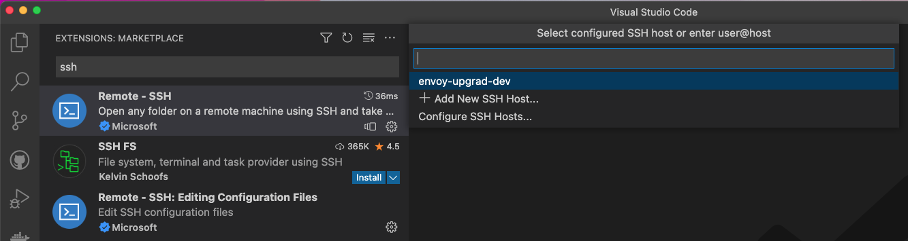
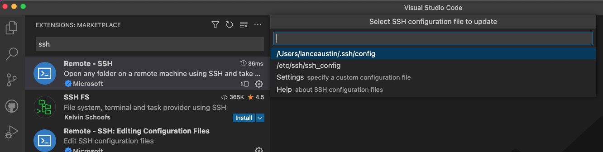
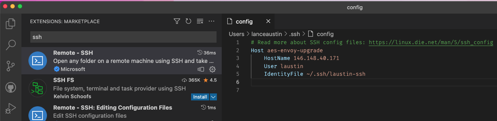

# Using VSCode over SSH

If you are a developer that prefers a GUI then VS Code provides a great extension for doing remote development over SSH but makes it feel like you’re developing locally.

This guide assumes you already have VS Code installed and are familiar with it generally speaking (i.e. extensions, command palette, etc…)

1. Open VSCode
2. Add the the Remote - SSH extension from Microsoft
   - <https://marketplace.visualstudio.com/items?itemName=ms-vscode-remote.remote-ssh>
3. Run the VS Code Command Remote-SSH: Connect to Host and will be shown this prompt.
   - If you have already configured the SSH and settings are all correct then all you have to do is select the name of the host you configured to connect. If it is your first time then head to the next step.
   
4. Select Configure SSH Hosts and you will be shown another prompt to chose where you want to configure your settings.
   - The example screen shot shows the default ssh location under the users home directory but you can choose to use custom files if you want. But, the defaults are usually sufficient.
   
5. Select your ssh config file and it will open up in the VS Code Editor
   - Add an entry to the file for the Host of your GCP VM. You will need the IP Address, the User and the Identity file that points to the private SSH key.
   - Save file once you are done editing
   - Note: The public SSH key needs to be added your VM and be associated to the same user id. See VM setup in the main README.md for instructions.
   

   ```ini
   # Read more about SSH config files: https://linux.die.net/man/5/ssh_config
   Host envoy-upgrad-dev
    HostName <public IP of your VM instance>
    User <your user>
    IdentityFile ~/.ssh/<ssh key file you generated in the VM setup guide>
   ```

6. Re-run the VS Code command Remote-SSH: Connect to Host and the prompt will now include your new entry. Select that to connect VS Code to the VM. VS Code will install the necessary components within the VM for it to work.
